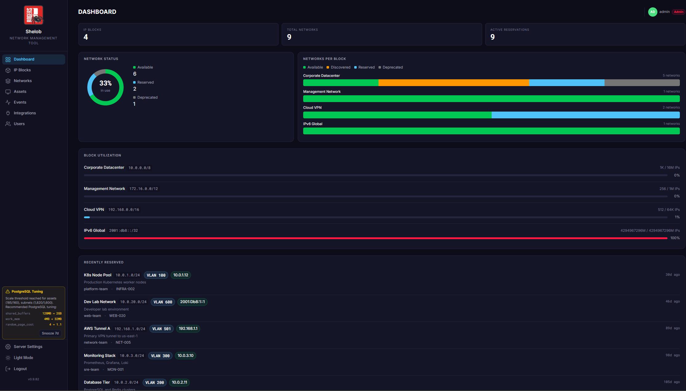
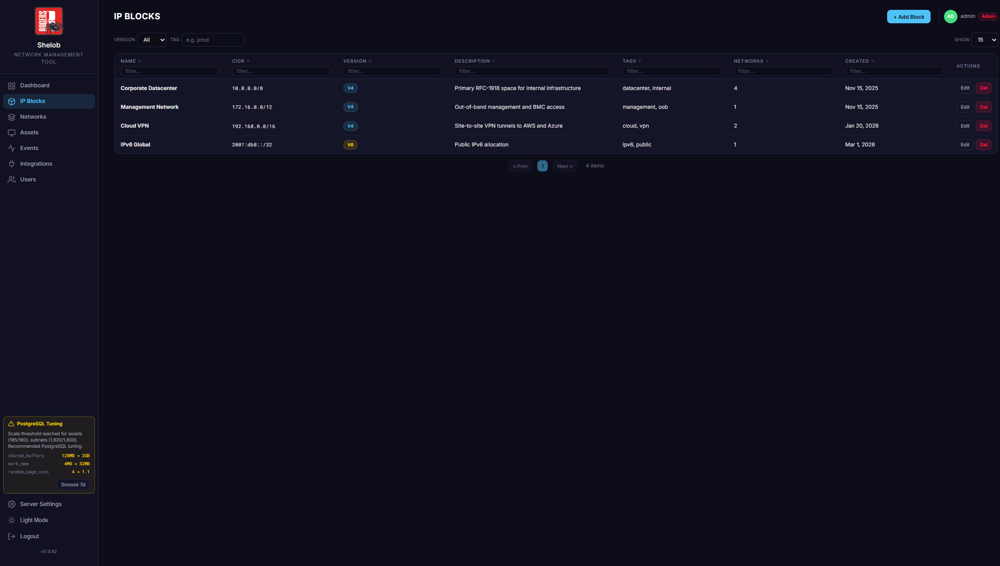
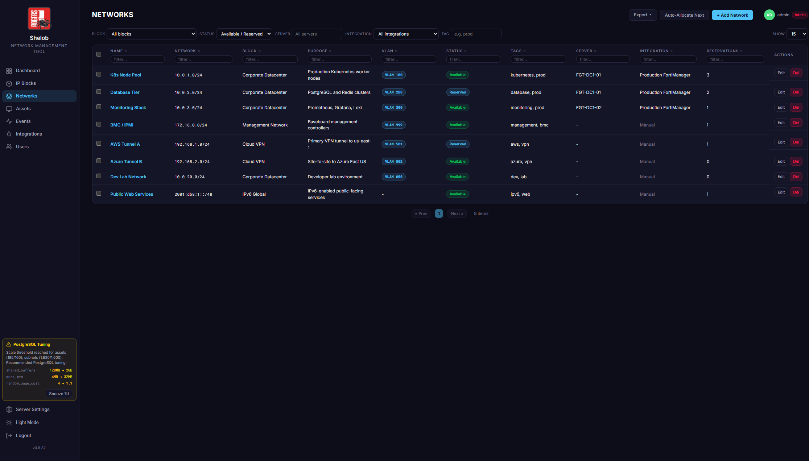

# Shelob

An IP address management (IPAM) tool for tracking and reserving IPv4/IPv6 space, managing network assets, and auto-discovering devices from FortiManager, standalone FortiGate, Windows Server DHCP, and Microsoft Entra ID / Intune.

## Features

- **IP Blocks, Subnets & Reservations** — Central registry with manual entry, next-available allocation, conflict detection, and VLAN tracking.
- **Bulk site allocation** — Save a multi-subnet template (e.g. `RGIHardware /25`, `RGIUsers /25`, `RGIVoice /26`…) and stamp it out for each site. Allocations are anchor-aligned (default `/24`, per-user) so each site's subnets stay grouped instead of filling prior gaps.
- **Asset Management** — Servers, switches, firewalls, APs, and other devices with MAC history, serials, warranty/procurement info, and auto-decommission after configurable inactivity.
- **FortiManager / FortiGate / Windows Server / Entra ID discovery** — Auto-discover DHCP scopes, interface IPs, VIPs, leases, FortiSwitches/FortiAPs, and Intune-registered devices. Discovery values that collide with manual records become `Conflict` records for admin review.
- **Global typeahead search** — Header search classifies IP / CIDR / MAC / text and returns blocks, subnets, reservations, assets, and individual IPs in one dropdown.
- **Azure SAML SSO** — SAML 2.0 with Azure AD / Entra ID, auto-provisioning, single logout, optional "skip login page" redirect.
- **Role-Based Access** — Admin, Network Admin, Assets Admin, User, Read-Only.
- **Event log** — Audit trail with syslog (CEF) forwarding, SFTP/SCP archival, 7-day rolling retention.
- **HTTPS & Security Hardening** — Built-in cert management (TLS 1.2+, AEAD-only), Helmet CSP, rate-limited login, session timeout, SAML RelayState CSRF.
- **Backup / Restore** — Encrypted database backups and in-app restore from the Server Settings page.
- **MAC OUI Lookup** — IEEE vendor lookup with admin-defined overrides.
- **PDF / CSV Export** — Assets, networks, events, and IP panel data.
- **Light / dark theme**, **first-run setup wizard**.

## Screenshots

| Dashboard | IP Blocks |
|-----------|-----------|
|  |  |

| Networks | Reservations |
|----------|--------------|
|  |  |

| Assets | Events |
|--------|--------|
|  |  |

## System Requirements

| Resource | Minimum (<50 devices) | Recommended (200+ devices, 200K+ reservations) |
|----------|----------------------|-----------------------------------------------|
| CPU | 2 vCPU | 4 vCPU |
| RAM | 4 GB | 8 GB |
| Disk | 20 GB SSD | 50 GB SSD |
| OS | Windows Server 2019+, RHEL 9, Ubuntu 22.04+ | Windows Server 2022, RHEL 9, Ubuntu 22.04+ |
| PostgreSQL | 15+ | 15+ |
| Node.js | 20 LTS | 20 LTS |

At large scale the discovery sync pre-loads all subnets, reservations, and assets for O(1) lookups; peak memory is ~200-400 MB on top of the Node.js base footprint.

**PostgreSQL tuning for large deployments** (`postgresql.conf`):

```
shared_buffers = 2GB
work_mem = 32MB
effective_cache_size = 4GB
max_connections = 20
random_page_cost = 1.1
```

## Quick Start (Development)

1. **Install PostgreSQL 15+** via your OS package manager or https://www.postgresql.org/download/, then create the database:

   ```sql
   -- As the postgres superuser:
   CREATE USER shelob WITH PASSWORD 'shelob';
   CREATE DATABASE shelob OWNER shelob;
   ```

2. **Install Node.js 20+** (https://nodejs.org).

3. **Clone, configure, run:**

   ```bash
   npm install
   cp .env.example .env          # edit DATABASE_URL if you changed the creds above
   npx prisma migrate dev --name init
   npm run db:seed               # optional — sample data
   npm run dev
   ```

The dashboard is at `http://localhost:3000`; the API at `http://localhost:3000/api/v1`. On the first visit the **Setup Wizard** walks through DB connection, admin account, and initial config (skip steps 2-3 above if you use it).

### Demo Mode

```bash
node demo.mjs
```

In-memory server on port 3000 with sample data. No database required.

## Production Deployment

Automated scripts install Node.js 20, PostgreSQL 15, the `shelob` system user, the database, app code (to `/opt/shelob` or `C:\shelob`), a random `SESSION_SECRET`, and a hardened service — then open port 3000 in the firewall. Run on a fresh server:

**RHEL / Rocky / Alma 9:**

```bash
git clone https://github.com/davidmoore-rogers/shelob.git && cd shelob
bash deploy/setup-rhel.sh
```

**Ubuntu / Debian:**

```bash
git clone https://github.com/davidmoore-rogers/shelob.git && cd shelob
bash deploy/setup-ubuntu.sh
```

**Windows Server 2019 / 2022** (run as Administrator):

```powershell
git clone https://github.com/davidmoore-rogers/shelob.git; cd shelob
powershell -ExecutionPolicy Bypass -File deploy\setup-windows.ps1
```

After the script finishes the app is live at `http://<server-ip>:3000` — log in with `admin` / `admin` and change the password.

### Updating

Automated update scripts handle backup, build, migration, and automatic rollback on any step failure:

```bash
bash deploy/update-linux.sh                                         # Linux
powershell -ExecutionPolicy Bypass -File deploy\update-windows.ps1  # Windows, as Admin
```

The flow: snapshot the commit → `pg_dump` backup (last 10 kept in `backups/`) → `git pull` → `npm ci` → build → stop service → migrate → start → HTTP smoke test. If any step fails the code, DB, and service are restored to the previous version.

Updates can also be triggered from the **Server Settings → Database** page in-app.

### Managing the service

**Linux (systemd):** `systemctl status|restart shelob`, `journalctl -u shelob -f`
**Windows (NSSM):** `nssm status|restart Shelob`, logs in `C:\shelob\logs\service-stdout.log`

### Manual setup

If you prefer not to use the scripts:

```bash
useradd --system --shell /bin/false --home-dir /opt/shelob shelob
git clone https://github.com/davidmoore-rogers/shelob.git /opt/shelob
chown -R shelob:shelob /opt/shelob && cd /opt/shelob
cp .env.example .env     # set DATABASE_URL, SESSION_SECRET, NODE_ENV=production
sudo -u shelob npm ci && sudo -u shelob npx tsc
sudo -u shelob npx prisma migrate deploy
cp deploy/shelob.service /etc/systemd/system/
systemctl daemon-reload && systemctl enable --now shelob
```

## API Overview

All endpoints live under `/api/v1/`.

| Resource | Base Path |
|---|---|
| IP Blocks | `/blocks` |
| Subnets | `/subnets` (incl. `/subnets/next-available` and `/subnets/bulk-allocate`) |
| Reservations | `/reservations` |
| Assets | `/assets` |
| Integrations | `/integrations` |
| Events | `/events` |
| Conflicts | `/conflicts` |
| Users | `/users` |
| Auth / SSO | `/auth` |
| Utilization | `/utilization` |
| Allocation Templates | `/allocation-templates` |
| Search | `/search` |
| Server Settings | `/server-settings` |

List endpoints support `limit` / `offset` pagination. See `CLAUDE.md` for full endpoint documentation and the domain model.

## Integrations

### FortiManager

On-premise FortiManager (**7.4.7+ / 7.6.2+**) via JSON-RPC with a bearer API token. Discovers DHCP scopes, DHCP leases + static reservations, interface IPs, VIPs, managed FortiSwitches, managed FortiAPs, and FortiGate device inventory. Default poll interval 12h. Optional device-level include/exclude filter.

### Standalone FortiGate

A single FortiGate via REST API — same discovery scope as FortiManager, for deployments not managed by one. Requires an API administrator token (System > Administrators > REST API Admin). Default poll interval 12h.

### Windows Server

Windows Server DHCP via WinRM (PowerShell remoting, port 5985 HTTP or 5986 HTTPS). Discovers v4 DHCP scopes. Default poll interval 4h.

### Microsoft Entra ID / Intune

Microsoft Graph via OAuth2 client credentials. **Produces assets only** — no subnets or reservations.

- **Entra ID** (always): hostname, OS, OS version, trust type, compliance, last sign-in. Requires `Device.Read.All` (application, admin-consented).
- **Intune** (optional toggle): serial, MAC, manufacturer, model, primary user, compliance state. Merged onto Entra devices via `azureADDeviceId ↔ deviceId`. Requires `DeviceManagementManagedDevices.Read.All`.

The Entra `deviceId` is stored on `Asset.assetTag` as `entra:{deviceId}` and is the correlation key for re-discovery. Hostname collisions with existing manual assets become `Conflict` records for admin/assetsadmin review. Default poll interval 12h.

## Authentication

- **Local accounts** — bcrypt-hashed. Passwords require 8+ characters with mixed case, a digit, and a special character.
- **Azure AD SAML SSO** — configured in Settings > SSO. SP Entity ID / ACS / SLS URLs are auto-derived. Supports `wantAssertionsSigned`, `wantAuthnResponseSigned`, optional "Skip Login Page" to redirect straight to Azure, configurable inactivity timeout, and user auto-provisioning on first login.

## Security

- TLS 1.2+ with AEAD-only cipher suites and configurable certificates
- Helmet.js Content Security Policy, HSTS, X-Frame-Options
- 10 login attempts / 15-minute window per IP
- HttpOnly + SameSite=Lax session cookies, session ID regenerated on login, configurable inactivity timeout
- SAML RelayState CSRF protection on SSO callbacks
- 1 MB max request body

## Running Tests

```bash
npm test                  # all tests once
npm run test:watch        # watch mode
npm run test:coverage     # with coverage report
```

## Tech Stack

| Layer | Technology |
|-------|-----------|
| Runtime | Node.js 20+ / TypeScript |
| Framework | Express 5 |
| ORM | Prisma |
| Database | PostgreSQL 15 |
| Validation | Zod |
| Logging | Pino |
| Testing | Vitest + Supertest |
| IP Math | `ip-cidr` + `netmask` |
| SSO | `@node-saml/node-saml` (SAML 2.0) |
| Security | Helmet, express-rate-limit |
